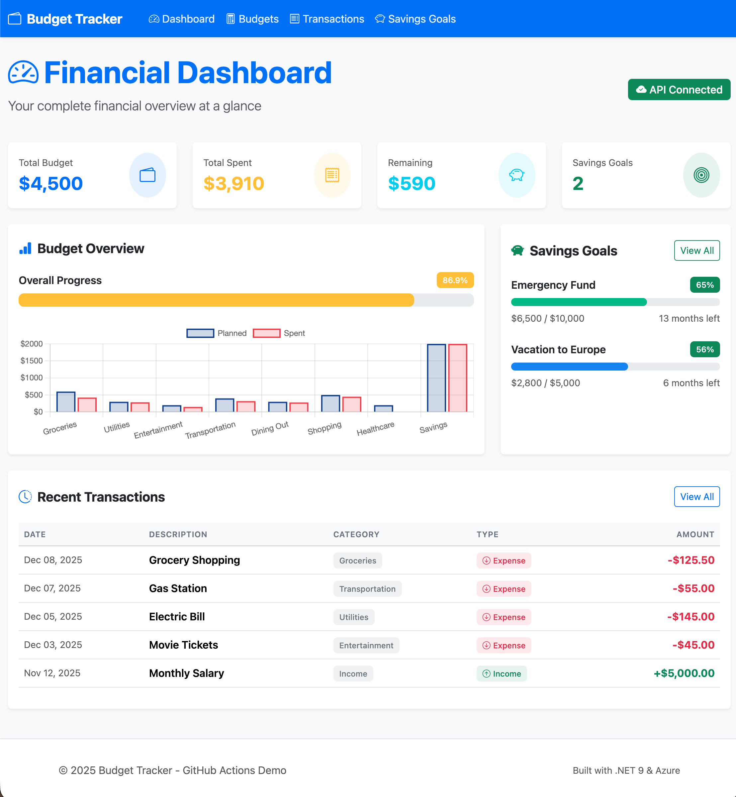
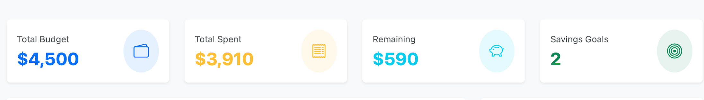
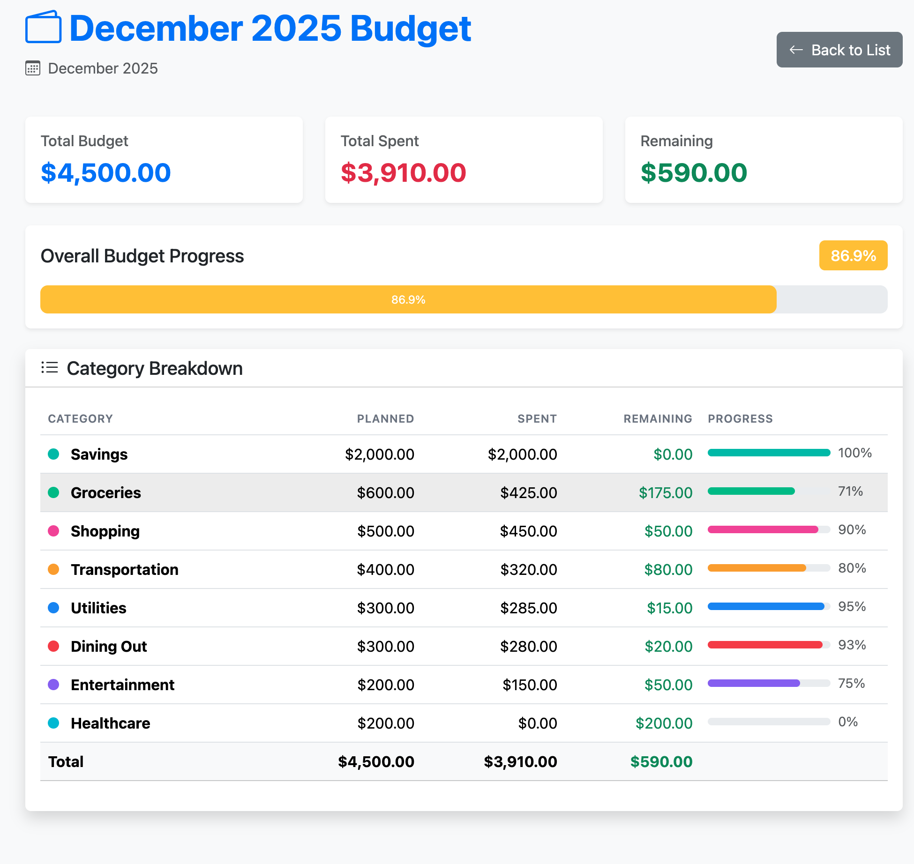
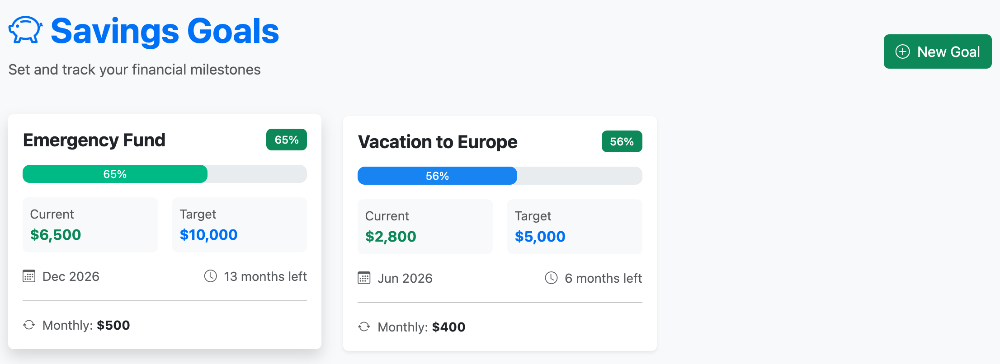
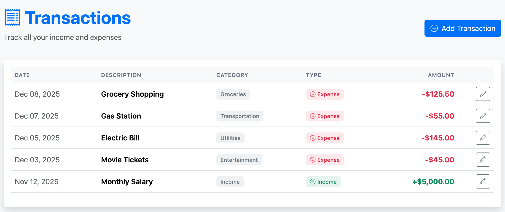

# Budget Tracker - GitHub Actions Demo

A fullstack personal budget and savings goal tracker built with .NET 9, designed to demonstrate GitHub Actions CI/CD workflows with Azure deployment.

## 🎯 Project Overview

This application showcases:

- **Frontend**: ASP.NET Core MVC with modern, responsive UI
- **Backend**: Azure Functions (Isolated Process Model) 
- **Demo Purpose**: GitHub Actions workflows for CI/CD automation
- **Cloud Platform**: Azure (Web App + Functions)

## ✨ Features

### Current Features (v1.0)

- 📊 **Interactive Dashboard** - Visual overview of budgets, spending, and savings
- 💰 **Budget Management** - Create and track monthly budgets by category
- 📝 **Transaction Tracking** - Record income and expenses
- 🎯 **Savings Goals** - Set and monitor financial goals with progress tracking
- 📈 **Charts & Visualizations** - Beautiful data visualization with Chart.js
- 💾 **In-Memory Data** - Sample data for demo purposes

### Planned Features

- 🔄 Database integration (Cosmos DB or Azure SQL)
- 🔄 Infrastructure as Code (Bicep templates)
- 🔄 Authentication (Azure AD B2C)
- 🔄 Advanced analytics and reporting

## 🛠️ Technology Stack

### Application

- **.NET 9.0** - Latest .NET version
- **ASP.NET Core MVC** - Frontend web framework
- **Azure Functions V4** - Serverless backend API (.NET Isolated Process Model)
- **Bootstrap 5** - Responsive UI framework
- **Chart.js** - Data visualization
- **Bootstrap Icons** - Icon library

### Azure Infrastructure

- **Azure Web App** - Hosting for MVC frontend
- **Azure Functions (Flex Consumption)** - Scalable serverless backend
- **Application Insights** - Monitoring and telemetry

### CI/CD

- **GitHub Actions** - Automated workflows
- **Azure RBAC** - Federated authentication (OIDC)
- **Artifact Management** - Build once, deploy anywhere

## 🚀 Getting Started

### Prerequisites

- [.NET 9 SDK](https://dotnet.microsoft.com/download/dotnet/9.0)
- [Azure Functions Core Tools](https://docs.microsoft.com/azure/azure-functions/functions-run-local)
- IDE: Visual Studio 2022, VS Code, or Rider
- Service Principal with Contributor access to the resource group (for deployment)

#### Setting up Azure Authentication

1. Create a Service Principal with Contributor access:

```bash
az ad sp create-for-rbac --name "gh-actions-budget-demo" \
  --role contributor \
  --scopes /subscriptions/{subscription-id}/resourceGroups/{resource-group-name} \
  --sdk-auth
```

1. Configure federated credentials for GitHub Actions (recommended):

```bash
az ad app federated-credential create \
  --id <APPLICATION_ID> \
  --parameters '{
    "name": "github-federated-credential",
    "issuer": "https://token.actions.githubusercontent.com",
    "subject": "repo:<OWNER>/<REPO>:environment:prod",
    "audiences": ["api://AzureADTokenExchange"]
  }'
```

1. Add the secrets to your GitHub repository settings, these secrets will be pulled from the output of the above command `create-for-rbac` and the values used in the `federated-credential create` command:

|Name|Value|
|----|-----|
|AZURE_CLIENT_ID|`<APPLICATION_ID>`|
|ENTRA_TENANT_ID|`<TENANT_ID>`|
|AZURE_SUBSCRIPTION_ID|`<SUBSCRIPTION_ID>`|

### Running Locally

#### Frontend (MVC Web App)

```bash
cd src/frontend/BudgetTracker.Web
dotnet restore
dotnet build
dotnet run
```

The web app will be available at `https://localhost:5001` (or the port shown in console).

#### Backend (Azure Functions)

```bash
cd src/backend/BudgetTracker.Functions
dotnet restore
dotnet build
func start
```

The API will be available at `http://localhost:7071`.

### Project Structure

``` bash
gh-actions-demo/
├── .github/
│   ├── workflows/
│   │   ├── main_red-scus-budget.yml      # Frontend deployment workflow
│   │   └── deploy-function-app.yml       # Backend deployment workflow
│   ├── chatmodes/                        # Custom chat modes
│   └── copilot-instructions.md           # Project guidelines & specs
├── src/
│   ├── frontend/
│   │   └── BudgetTracker.Web/            # ASP.NET Core MVC project
│   │       ├── Controllers/              # MVC controllers
│   │       ├── Models/                   # Data models
│   │       ├── Views/                    # Razor views
│   │       ├── Services/                 # API client & business logic
│   │       └── wwwroot/                  # Static assets (CSS, JS, libs)
│   └── backend/
│       └── BudgetTracker.Functions/      # Azure Functions project
│           ├── Functions/                # HTTP-triggered functions
│           │   ├── BudgetFunctions.cs
│           │   ├── TransactionFunctions.cs
│           │   └── SavingsGoalFunctions.cs
│           ├── Models/                   # Data models
│           ├── Services/                 # In-memory data service
│           └── host.json                 # Functions runtime config
├── gh-actions-demo.sln                   # Solution file
├── README.md
└── .gitignore
```

## 📱 Screenshots

### Dashboard

The main dashboard provides a comprehensive view of:

- Main Dashboard
  - 
- Budget summary cards
  - 
- Spending vs. planned budget chart
  - 
- Savings goals progress
  - 
- Recent transactions list
  - 

### Features

- **Budget Overview**: Visual comparison of planned vs. actual spending
- **Savings Goals**: Track multiple goals with progress indicators
- **Transactions**: Complete transaction history with filtering

## 🔗 API Endpoints

### Budgets

- `GET /api/budgets` - Get all budgets
- `GET /api/budgets/{id}` - Get budget by ID
- `POST /api/budgets` - Create new budget

### Transactions

- `GET /api/transactions` - Get all transactions
- `GET /api/transactions/{id}` - Get transaction by ID
- `POST /api/transactions` - Create new transaction

### Savings Goals

- `GET /api/savings-goals` - Get all savings goals
- `GET /api/savings-goals/{id}` - Get savings goal by ID
- `POST /api/savings-goals` - Create new savings goal

## 🎨 Design System

### Color Palette

- **Primary**: #1E3A8A (Financial Blue)
- **Success**: #10B981 (Green)
- **Warning**: #F59E0B (Amber)
- **Danger**: #EF4444 (Red)
- **Info**: #3B82F6 (Blue)

### UI Principles

- Clean, modern design
- Mobile-first responsive layout
- Accessibility (WCAG 2.1 AA)
- Smooth transitions and animations

## 🚀 GitHub Actions Workflows

### Active Workflows

#### 1. Frontend Deployment (main_red-scus-budget.yml)

**Trigger**: Push to `main` branch (frontend changes only)

- ✅ Build .NET 9 MVC application
- ✅ Run tests and validation
- ✅ Deploy to Azure Web App (`red-scus-budget`)
- 📦 **Deployment Method**: Publish Profile (secure credential storage)

**Azure Resources**:

- **Web App**: `red-scus-budget` (Production slot)
- **Environment Variable**: `API_BASE_URL` - Points to Function App endpoint

#### 2. Backend Deployment (deploy-function-app.yml)

**Trigger**: Push to `main` branch (backend changes only) or manual dispatch

- ✅ Build .NET 9 Azure Functions (Isolated Process Model)
- ✅ Create Flex Consumption deployment package
- ✅ Deploy to Azure Function App (`red-scus-budgetbackend-demo`)
- 🔐 **Authentication**: Azure RBAC with OIDC (federated credentials)
- 📦 **Deployment Method**: Zip Deploy with `.azurefunctions` metadata

**Azure Resources**:

- **Function App**: `red-scus-budgetbackend-demo` (Flex Consumption plan)
- **Resource Group**: `red-scus-ghactions-demo-rg`
- **Region**: South Central US

### Key Features

- **Path-based Triggers**: Workflows only run when relevant code changes
- **Artifact Management**: Build once, deploy artifact
- **Environment Protection**: Production environment with optional approval gates
- **RBAC Security**: Backend uses federated credentials (no secrets in repo)
- **Hidden Files Handling**: Includes `.azurefunctions` directory for Flex Consumption

### Planned Workflow Enhancements

- 🔄 **CI Workflow** - Unit tests, code coverage, linting
- 🔄 **Security Scanning** - CodeQL analysis, dependency scanning
- 🔄 **Performance Testing** - Azure Load Testing integration
- 🔄 **Infrastructure as Code** - Bicep template deployment

## 📝 License

This project is for demonstration purposes.

## 🤝 Contributing

This is a demo project, but suggestions and improvements are welcome!

---

Built with ❤️ using .NET 9 and Azure
Demo repo for github actions using .net. Frontend and backend app that will be deployed to Azure using actions.
